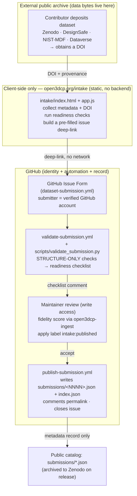

# Open3DCP intake — architecture, data flow & security

How a dataset becomes a curated Open3DCP record: the external links it touches, where data lives,
what makes each decision, and who performs review. Open3DCP is a **curation layer, not an archive** —
dataset *bytes* always live in a public archive; only *metadata* is recorded in this repository.

> **One-line trust model:** no server, no database, and no secret in this repository. The submitter's
> GitHub account is the verified identity; an automated check validates *structure only*; a human
> maintainer with write access performs acceptance and computes the fidelity score.

## Data flow

## Components and responsibilities

| Component | Location | Role | Decides? |
|---|---|---|---|
| Intake page | `intake/index.html`, `intake/app.js`, `intake/styles.css` | Collect metadata + DOI, run client-side readiness checks, build a pre-filled GitHub-issue deep-link. **No network calls, no secrets.** | No — assists the submitter only |
| External archive | Zenodo / DesignSafe / NIST-MDF / Dataverse | Stores the dataset **bytes**; issues the **DOI**. | No |
| GitHub Issue Form | `.github/ISSUE_TEMPLATE/dataset-submission.yml` | The submission itself; binds it to the submitter's GitHub identity. | No |
| Automated validator | `.github/workflows/validate-submission.yml` → `scripts/validate_submission.py` | **Structure-only** checks (required fields, DOI/ORCID format, redistributable license, DOI de-duplication) → one readiness-checklist comment. | **Yes — structure only.** Never computes the fidelity score; never accepts. |
| Maintainer / curator | A repo member with **write access** | Reviews the submission, computes the authoritative **0–100 fidelity score** with `open3dcp-ingest`, and decides acceptance via the `intake:published` label. | **Yes — acceptance + quality.** |
| Publish workflow | `.github/workflows/publish-submission.yml` → `scripts/publish_record.py` | On `intake:published` (write-access only): writes `submissions/<NNNN>.json`, appends `index.json`, comments the permalink, closes the issue. | No — executes the maintainer's decision |
| Catalog | `submissions/index.json`, `submissions/<NNNN>.json` | The curated metadata record. Archived to Zenodo with the repo on release. | No |

## Data residency

| Data | Where it lives | In this repo / Zenodo snapshot? |
|---|---|---|
| Dataset bytes (CSV/HDF5/images/curves) | External public archive (Zenodo/DesignSafe/NIST-MDF/Dataverse) | **No — never committed** |
| Dataset DOI + provenance metadata | `submissions/<NNNN>.json`, `index.json` | Yes — permanent, archived under the Zenodo DOI on release |
| Submitter identity | `github_login` + immutable `github_user_id`; self-asserted `declared_orcid` | Yes — recorded in the metadata record |
| Secrets / credentials | **Nowhere in the repo**; CI uses `${{ secrets.X }}` at runtime only | No |

## Security model & trust boundaries

- **No backend, no database, no secret in the repository.** The intake page is static and makes no
  network calls; it only builds a GitHub deep-link.
- **Identity** is the submitter's authenticated **GitHub account** (`github_login` + immutable
  `github_user_id`). An **ORCID iD** may be declared; it is format/checksum-validated but
  **self-asserted** (not OAuth-verified) — a curator may cross-check it during review.
- **Privilege boundary:** anyone can *open* a submission issue; only repo members with **write
  access** can apply `intake:published` and thereby commit a record.
- **CI secrets** (e.g. Cloudflare deploy tokens) are GitHub Actions `${{ secrets.X }}` runtime
  expressions — no credential values are committed.
- **Vulnerability disclosure:** see [`/.well-known/security.txt`](../.well-known/security.txt).

## Decision authority (explicit)

- **Automated = structure only.** The validator confirms the submission is *well-formed and
  redistributable*; it never judges scientific quality and never auto-accepts.
- **Human = acceptance + quality.** A maintainer computes the fidelity score and makes the
  publish decision. The 0–100 score is produced by [`open3dcp-ingest`](../tools/ingest/) during
  curation, **never invented automatically**.

## Contributor data handling (PII)

A published record permanently associates a dataset with its submitter's GitHub identity (and, if
provided, a self-declared ORCID and a free-text "lead author / lab"). Because the catalog is
archived to Zenodo on release, these fields become part of a citable, permanent record. Contributors
should submit only attribution they are content to publish openly; the maintainer curates free-text
fields for inadvertent personal information before acceptance. Citing a dataset's already-public
authors is normal scholarly attribution and is expected.

## Reference files

`intake/README.md` (portal), `submissions/README.md` (lifecycle + labels),
`.github/ISSUE_TEMPLATE/dataset-submission.yml` (form), `.github/workflows/validate-submission.yml`
and `publish-submission.yml` (automation), `scripts/validate_submission.py` and `publish_record.py`
(logic), `tools/ingest/` (the fidelity score).
